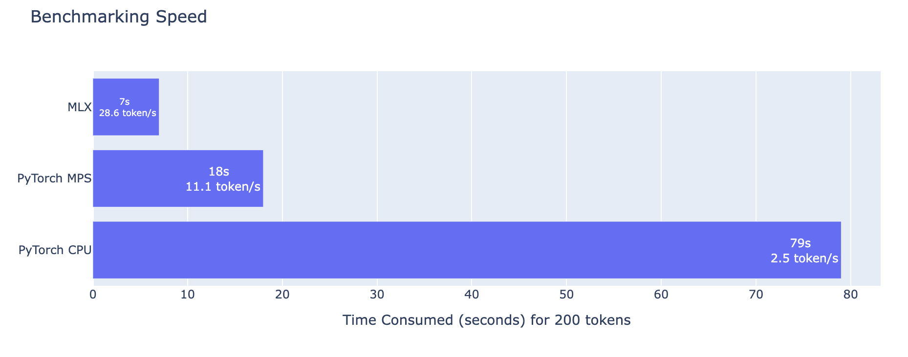
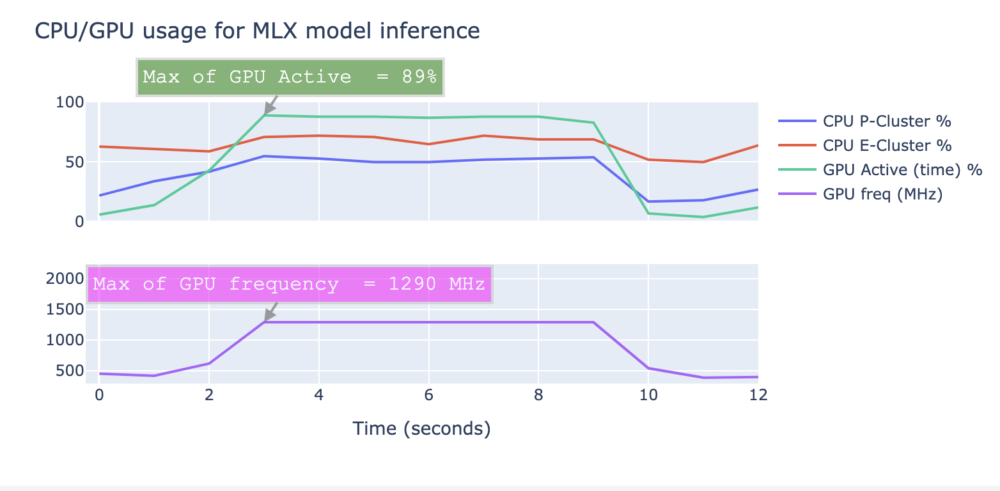
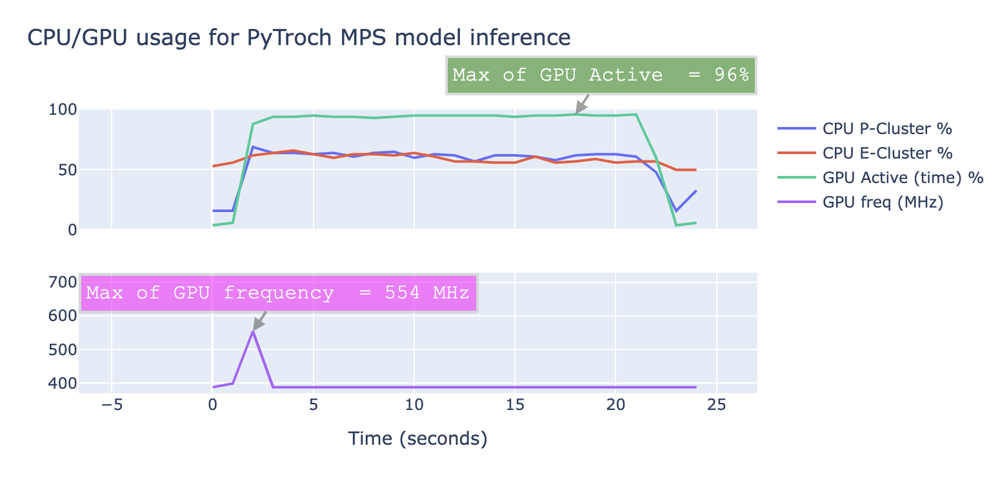

# Benchmark of running Phi-2 LLM on MLX and PyTorch on MPS device

Code for the [article](https://medium.com/@koypish/mps-or-mlx-for-domestic-ai-the-answer-will-surprise-you-df4b111de8a0) about speed comparison of MLX and PyTorch on Apple's M1 MAX GPU: https://medium.com/@koypish/mps-or-mlx-for-domestic-ai-the-answer-will-surprise-you-df4b111de8a0

## Installation
* `pyenv install 3.11`
* `pyenv local 3.11`

1st option:
* `poetry shell`
 
2nd option:
* `python -m venv .venv; source .venv/bin/activate`
* `pip install -r requirements.txt`

## Run Phi-2 benchmarks
* `make mlx`
* `make mps` - for PyTorch on Metal GPU
* `make cpu` - for PyTorch on CPU

In order to track CPU/GPU usage, keep `make track` running while performing operation of interest.

## Results on M1 Max (MacOS Sonoma 14.1.1)

## Structure
* `utils.py` contains memory measurement utils
* `try_phi2_torch.ipynb`, `try_phi2_mlx.ipynb` - benchmarks code
* `phi2_mlx.py` - code mainly copied from https://github.com/ml-explore/mlx-examples/tree/main/llms/phi2
* `plot_metrics.ipynb` - contains code to parse and analyze output of `powermetrics` (run by `make track`) 
  

